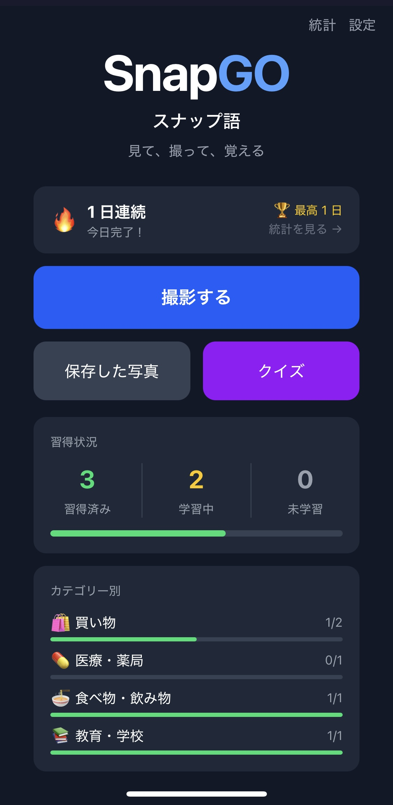
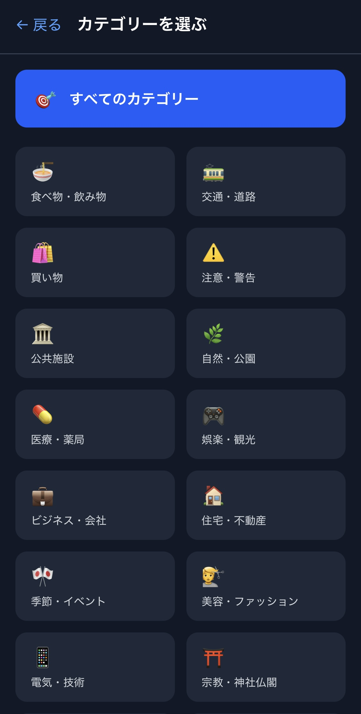
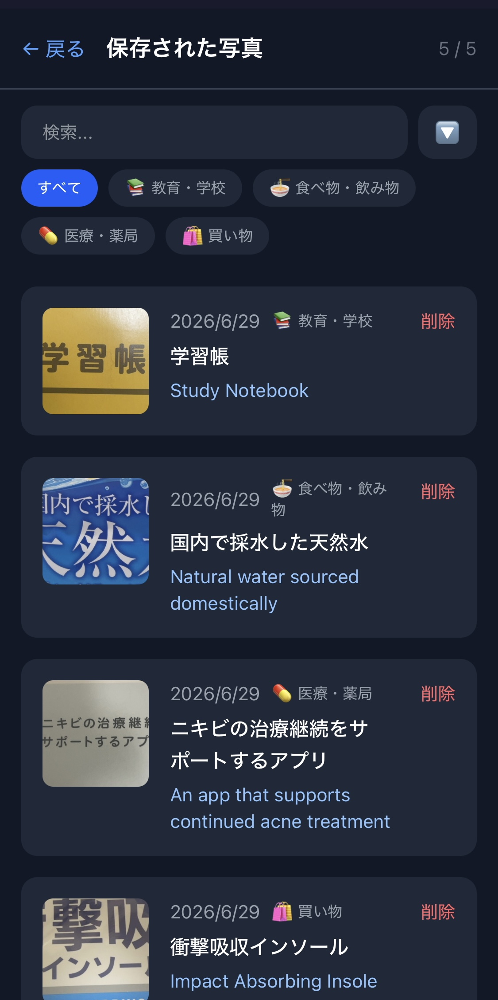
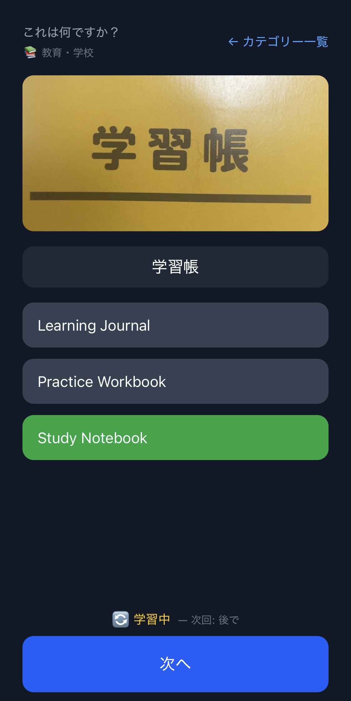
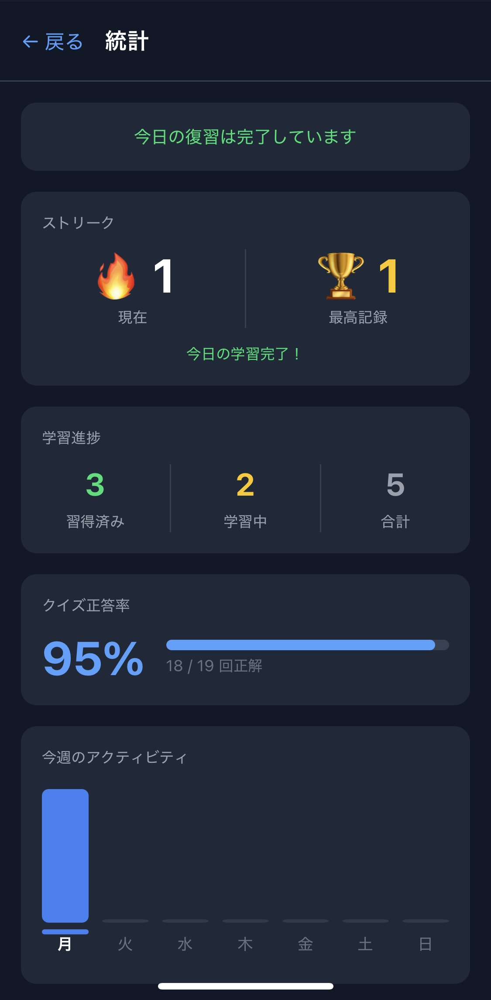
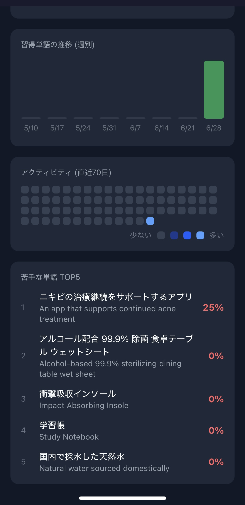

# SnapGO / スナップ語
**写真で日本語を学ぶPWAアプリ — v1.1.0**  
**A PWA for learning Japanese through real-world photos**

🔗 **Live Demo:** [snap-go-alpha.vercel.app](https://snap-go-alpha.vercel.app)

---

## なぜ作ったのか / Why I Built This

日本に住む外国人として、街中の看板・メニュー・標識が読めない場面に何度も直面しました。既存の翻訳アプリはテキスト入力が前提で、「見て、その場で覚える」体験を提供するものはありませんでした。

SnapGOはただの翻訳ツールではありません。カメラで撮った実際の写真をもとに、SM-2アルゴリズムによる間隔反復学習（SRS）で日本語を定着させるための学習アプリです。

As a foreigner living in Japan, I constantly encountered signs, menus, and notices I couldn't read. Existing tools required typing — none let you simply point your camera and actually *learn* from what you see.

SnapGO is not just a translator. It's a learning app that turns real-world photos into flashcards, using the SM-2 spaced repetition algorithm (SRS) to help vocabulary stick.

---

## スクリーンショット / Screenshots

<table>
  <tr>
    <td align="center"></td>
    <td align="center"></td>
    <td align="center"></td>
  </tr>
  <tr>
    <td align="center"></td>
    <td align="center"></td>
    <td align="center"></td>
  </tr>
</table>

---

## 機能 / Features

| 機能 | 詳細 |
|------|------|
|  カメラスキャン | ピンチズーム・枠リサイズ対応、後カメ自動選択 |
|  AI OCR + 翻訳 | Claude Vision APIで文字認識・英訳・カテゴリー分類を1リクエストで実行 |
|  16カテゴリー自動分類 | 食べ物・交通・医療など16種類にAIが自動で振り分け |
|  SRSクイズ | SM-2アルゴリズムによる間隔反復学習。3択クイズで語彙を定着 |
|  復習キュー | 学習状態（新規・学習中・復習待ち・習得済み）を自動管理 |
|  ストリーク | 連続学習日数を記録。JST対応 |
|  統計ダッシュボード | 正答率・週間アクティビティ・習得推移・苦手単語TOP5 |
|  位置情報マップ | 撮影場所をカテゴリー別マーカーで地図上に可視化 |
|  プッシュ通知 | 週次まとめ＋ストリーク・復習リマインダー |
|  検索・フィルター | 日本語・翻訳・カテゴリーで履歴を絞り込み |
|  スキャン保存 | 画像・テキスト・カテゴリー・位置情報をSupabaseに保存 |
|  翻訳修正 | ユーザーが翻訳を修正→フィードバックループ形成 |
|  PWA対応 | ホーム画面に追加でネイティブアプリのように動作 |
|  匿名認証 | アカウント登録不要、即座に使用可能 |

---

## 技術スタック / Tech Stack

**Frontend**
- React 19 + TypeScript
- Vite
- Tailwind CSS
- i18next
- Leaflet + react-leaflet（地図表示）

**AI / Backend**
- Claude Haiku API（Vision OCR + 翻訳 + カテゴリー分類）
- Vercel Edge Functions（APIプロキシ）
- Vercel Cron Jobs（週次・日次プッシュ通知）
- web-push（プッシュ通知配信）

**Infrastructure**
- Supabase（PostgreSQL + Auth + Storage）
- Row Level Security（ユーザーデータ分離）
- Vercel（静的ホスティング + CDN）

**主なテーブル / Key Tables**
- `scans` — スキャン履歴（画像URL・OCRテキスト・翻訳・カテゴリー・位置情報）
- `quiz_attempts` — クイズ回答履歴（streak・正答率の計算に使用）
- `srs_state` — SM-2状態（interval_days・ease_factor・next_review_at）
- `push_subscriptions` — プッシュ通知購読情報

---

## アーキテクチャ / Architecture

```
[Camera / Photo Library]
        ↓
[React Frontend (PWA)]
        ↓
[Vercel Edge Function]  ← APIキーをサーバー側で保護
        ↓
[Claude Haiku Vision API]  ← OCR + 翻訳 + カテゴリー分類を1リクエストで実行
        ↓
[Supabase]  ← 画像Storage + scans / quiz_attempts / srs_state テーブル
        ↓
[Result Screen]  ← 翻訳表示 → SRSクイズ → 統計ダッシュボード
```

**設計上の判断 / Key Design Decisions**

- **クライアントサイドOCRではなくAPIを採用** — 精度とバンドルサイズのトレードオフを考慮
- **Edge Functionでプロキシ** — APIキーをブラウザに露出させない
- **匿名認証＋RLS** — バックエンドサーバーなしでユーザーデータを安全に分離
- **SRS状態を専用テーブルで管理** — quiz_attemptsからの都度計算ではなくsrs_stateで永続化、クエリ効率を向上
- **カテゴリーは閉じたリスト16種** — AIに自由生成させず固定リストから選択させることでダッシュボードの一貫性を担保

---

## ローカル起動 / Local Setup

```bash
git clone https://github.com/Edgarchik-Tatarchik/SignLens.git
cd SignLens
npm install
```

`.env.local` を作成 / Create `.env.local`:
```
VITE_SUPABASE_URL=your_supabase_url
VITE_SUPABASE_ANON_KEY=your_anon_key
```

Vercel Edge Function用の環境変数（サーバー側）/ Server-side env var:
```
ANTHROPIC_API_KEY=your_anthropic_key
```

```bash
npm run dev        # 開発サーバー / Dev server
vercel             # Preview deploy
vercel --prod      # Production deploy
```

---

## バージョン履歴 / Changelog

### v1.3.0 — 位置情報マップ / Geo-Tagged Map
- スキャン位置（緯度・経度）を記録
- 位置情報の利用許可を説明するモーダルを追加
- Leaflet + CartoDB Dark Matterによるインタラクティブマップ
- カテゴリー別マーカー表示・自動ズーム・カテゴリーフィルター

### v1.2.0 — エンゲージメント機能 / Engagement Features
- ストリーク機能（連続学習日数の記録、JST対応）
- 統計ダッシュボード刷新（週間アクティビティグラフ・習得推移グラフ）
- 苦手単語TOP5の自動集計
- 復習待ち単語の可視化と直接クイズへの導線
- プッシュ通知をストリーク・復習リマインダーに対応

### v1.1.0 — 学習システム全面刷新 / Learning System Overhaul
- SM-2アルゴリズムによるSRS実装（srs_stateテーブル）
- 16カテゴリー自動分類（Claude APIで分類）
- カテゴリー別クイズ・復習キュー
- スキャン履歴の検索・カテゴリーフィルター
- カメラのピンチズーム・枠リサイズ対応
- SnapGO / スナップ語へのリブランディング

### v1.0.0 — 初回リリース / Initial Release
- カメラスキャン・OCR翻訳
- スキャン保存・履歴表示
- 基本クイズ（3択）
- PWA対応・匿名認証

---

## 今後の予定 / Roadmap

- [ ] 英語UIへの完全対応
- [ ] App Store / Google Playへのリリース

---

## 作者 / Author

**Edgar** — [GitHub](https://github.com/Edgarchik-Tatarchik/SignLens)
